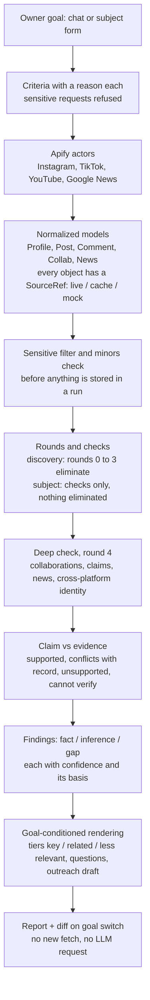

# Creator Scout

Creator Scout helps the owner of a small business, such as a bakery or a fitness studio in Brno, decide which social-media creator to work with. The owner is not a marketer. She states a goal, and the app turns it into criteria she can see, edit or switch off. It then checks public creator accounts against those criteria and writes a report in which every claim links to its source, facts are kept apart from inferences, and gaps are stated. There is no overall score and no "best creator". The owner decides.

Built for the Apify track of a hackathon. All platform data comes from Apify actors.

**Status at the code freeze (9 Oct 2026):** subject mode and the English UI are on `main`. 2 public Brno accounts were researched live through Apify and are replayed from the cache, labeled CACHE. The discovery funnel runs on the recorded Brno data from the cache, but it was not re-run live after the engine fixes. Measured results, including 2 failed checks, are in [Validation](#validation).

## Quick start (about 60 seconds)

Tested with Python 3.14 and Node 26 on macOS.

### 1. Mock mode (no keys)

```bash
python3 -m venv backend/.venv
backend/.venv/bin/pip install -r backend/requirements.txt
scripts/dev-backend.sh            # http://127.0.0.1:8000, SOURCE_MODE defaults to mock

# second terminal
scripts/dev-frontend.sh           # http://127.0.0.1:5173, proxies /api to :8000
```

Open http://127.0.0.1:5173. Everything you see is fictional MOCK data and is labeled MOCK. The UI is in English by default; `?lang=cs` switches to Czech.

- **Subject mode:** type `Check @kuba.jidlo.brno for my bakery in Brno`. The chat asks for one anchor; answer `Brno`. Then type `what about my fitness studio?` to switch the goal and see what changed in the report.
- **Discovery:** type `demo`, then `yes`. The funnel runs rounds 0 to 3. Ask for the deep check of the finalists, then change the goal to a fitness studio.

Other mock subjects: `@fit_peci_s_klarou` with anchor `fitpeceni.example` (identity confirmed), `@toman_ochutnava` on TikTok (a namesake in the news is set aside), `@brnenska_snidane` (a fan account is set aside), `@nobody_here_xyz` (not found).

**Online demo replay:** https://creator-scout-demo.vercel.app (noindex). It is the static `/?demo=1` replay: it runs in the browser with its own canned MOCK data and has no backend, so it makes no Apify or LLM calls.

Backend tests: `cd backend && .venv/bin/python -m pytest -q`. They always use a temporary data folder.

### 2. Cache replay of the recorded live runs

On 9 October 2026 we recorded real runs through Apify into a cache. They hold real public data, so they are not in this repo (`data/` is gitignored) and we delete them after judging. On the machine that holds them:

```bash
SOURCE_MODE=cache DATA_DIR="$PWD/data/live-run"     scripts/dev-backend.sh   # discovery runs
SOURCE_MODE=cache DATA_DIR="$PWD/data/live-subject" scripts/dev-backend.sh   # subject runs
```

Without `APIFY_TOKEN` the cache is read only: a miss is logged and nothing is fetched. Every object is labeled CACHE and keeps its original fetch date. LLM answers are cached per provider, so a replay without the same LLM key uses the labeled rule-based fallback for the LLM-written parts. A cache folder from elsewhere can be imported with `.venv/bin/python -m app.sources.cache import <dir>` (run in `backend/`).

### 3. Live mode

Copy `.env.example` to `.env` in the repo root and set:

```
SOURCE_MODE=apify
APIFY_TOKEN=apify_api_...
OPENROUTER_API_KEY=sk-or-...        # or ANTHROPIC_API_KEY=sk-ant-... (LLM_PROVIDER=auto prefers Anthropic when both are set)
MAX_USD_PER_RUN=3                   # cost cap per actor run (default 3)
```

Live mode writes through to the cache, so running the same subject again, or switching its goal, makes no new Apify calls. `GET /api/health` shows the source mode, the LLM provider and model, and the LLM request budget. The main variables are described in `.env.example`. The optional Apify switches (`APIFY_IG_SEARCH`, `APIFY_PLACES`, `APIFY_TIKTOK_SEARCH`, `APIFY_META_BRANDED` and others) are described at the top of [backend/app/sources/apify_provider.py](backend/app/sources/apify_provider.py).

## Two entry points

1. **Subject mode.** Input: a person or organisation as an Instagram or TikTok `@handle` or profile link, one anchor (the city they are based in, their website, or a Czech company ID, IČO) and a goal ("my bakery in Brno"). Output: a sourced report. It opens with an identity verdict (confirmed, likely, uncertain, not found) and lists what it set aside: namesakes in the news, look-alike and fan accounts. The goal's criteria run as checks. Nothing is eliminated and nothing is scored.
2. **Discovery funnel.** The chat asks a few plain questions (what you sell and where, who you sell to, what the campaign should do, rough budget, competitors). The answers become explicit criteria with a reason each. The app finds candidates and narrows them in rounds: basics, content, audience signals. Every elimination shows its round, the reason and the source, and can be undone. Up to five finalists get a deep check, only after the owner says yes.

**Switching the goal changes the report.** The same subject with a fitness studio instead of a bakery gets a different report from the data already fetched: no new fetch and no LLM request. A diff lists which findings became key or less relevant, which checks changed, which competitor collaborations now matter, and which questions and outreach draft changed. On real data this does not always change a check result: see A4 in [Validation](#validation).

### Mapped to the official definition of done

| Definition of done | What Creator Scout does | Status |
|---|---|---|
| Input: person or organisation + one anchor + a goal | Subject mode: `@handle` or profile link + city, website or IČO + goal. A bare name gets one question for the account, so a namesake is never picked silently. | Real code, on `main`. Run on 2 real subjects (next rows). |
| Every claim links to a source | Every fact carries platform, URL, fetch date, live / cache / mock, actor and a short quote. A creator's claim is used only when quoted word for word from the fetched bio or caption. | Real code. On the 2 real subjects: 0 facts without a source (A1), 134 of 134 quotes found in the fetched items (A2). |
| Facts split from inferences, gaps stated | Fact = sourced. Inference = cites the fact ids it rests on. Gap = stated, and becomes a question for the first meeting. Each finding has a confidence (high, medium, low) with its basis. | Real code. On the 2 real subjects: 83 facts, 4 inferences, 13 gaps; 0 of 100 findings without a confidence and basis. |
| Same subject, different goal, different report | Goal switch re-renders the report from stored data and shows a diff. | Real code. On the 2 real subjects, bakery to fitness: questions and the outreach draft change for both; a check result changes for 1 of 2 (A4). |
| A real subject researched live | Through Apify actors, recorded into the cache. | Done: 2 public Brno media accounts on Instagram, @kamvbrne and @foodguidebrno (a city guide and a food guide), anchor city Brno, goal bakery, then switched to fitness studio. Recorded live on 9 Oct 2026 at about 03:23: 275 s and 326 s, about 0.19 and 0.16 USD in Apify. |
| Namesakes and look-alikes handled | Identity verdict with signals for and against. Namesake news, look-alike and fan accounts are set aside, never attributed. | Real code. On the 2 real subjects: verdict "likely" (2 supporting signals each). With a wrong anchor (Ostrava instead of Brno), @kamvbrne comes out "uncertain" with 1 contradicting signal and is not matched. News not tied to the account was set aside: 10 and 3 items. Setting aside look-alike and fan accounts is shown on MOCK data only. |
| The user sees how the report was built | "How this report was built" panel: what was fetched, what was filtered, which steps used AI and which used rules. The run log names the actor on every line. | Real code, in the subject report view. Looked at in the browser on @kamvbrne from the cache replay while preparing the demo (identity verdict, source chips, goal-switch panel, run log); not a scripted check. |
| Out of scope: scores, scrapers, private data, sending | No score, no scraper of our own, public profiles only, outreach is a draft that is never sent. | Real code. See [Hard lines](#hard-lines-and-where-they-are-enforced). |

## How a report is built



1. **Fetch.** Only the provider in [backend/app/sources/apify_provider.py](backend/app/sources/apify_provider.py) talks to Apify. It maps actor output into the models in [backend/app/models.py](backend/app/models.py). A write-through cache ([backend/app/sources/cache.py](backend/app/sources/cache.py)) sits in front of it. The mock provider uses the same protocol.
2. **Filter.** Sensitive posts, comments and news are dropped before they are stored in a run; only a count is kept. Minors are dropped with nothing stored.
3. **Check.** Rounds in [backend/app/rounds/](backend/app/rounds/) evaluate each criterion as pass, fail or unknown. Missing data gives unknown and never eliminates anyone.
4. **Vet.** Round 4 fetches collaborations, news and cross-platform profiles once and stores them on the candidate.
5. **Render.** [backend/app/rounds/report.py](backend/app/rounds/report.py) is a pure function: the same criteria and data always give the same report. It is rerun on every goal switch.

Full contract: [docs/architecture.md](docs/architecture.md). Subject mode and the confidence table: [docs/subject-mode.md](docs/subject-mode.md).

## Apify actors

| Actor | Used for | Live result, 9 Oct 2026 |
|---|---|---|
| `apify/instagram-search-scraper` | Discovery: user search and place search | Works. Instagram's own live search returns thin items and matches names, so it finds Brno-named organisations. Non-live search is the default. |
| `apify/instagram-hashtag-scraper` | Discovery: authors of hashtag posts | Partly. Free plan returns only the first page (12 or 24 posts). Paid-partnership label was false on 35 of 35 posts. |
| `apify/instagram-scraper` | Discovery: authors of posts at Brno places | Works. One place item with 15 to 18 nested posts. |
| `apify/instagram-profile-scraper` | Rounds 1 to 3: profile and 12 latest posts | Works. Posts carry no paid labels and no co-authors. |
| `apify/instagram-post-scraper` (detailed) | Rounds 2 to 4: labels, places, co-authors, up to 15 latest comments | Works. Paid-partnership label true on 3 of 3 labeled control posts, false on 21 of 21 Czech posts. |
| `apify/instagram-comment-scraper` | Not used by default | Not needed: the post scraper returns comments. |
| `clockworks/tiktok-scraper` | TikTok user search | Partly. Matches the word in the name and returns businesses. Off by default. |
| `clockworks/tiktok-profile-scraper` | Cross-platform identity, TikTok posts | Partly. Profiles come back, but `region` and `isUnderAge18` are missing, even for a foreign account (T10 is marked failed for that). |
| `clockworks/tiktok-comments-scraper` | TikTok comments | Not live-tested. |
| `data_xplorer/google-news-scraper-fast` | News about the creator, namesake check | Works. 10 of 10 URLs point to publishers. |
| `streamers/youtube-scraper` | YouTube channel from a bio link | Works. `isPaidContent` filled as expected. |
| `apify/brand-collaboration-scraper` | Meta Branded Content | Failed for Czech brands. Off by default. |

Live tests: T1 to T12 in [docs/verification.md](docs/verification.md#live-test-update-2026-10-09).

**What failed live, and what we did:**

- **Meta Branded Content is empty for Czech brands.** rohlik.cz returned only a `no_items` error item, which was still charged. We cut it. Collaborations now come from platform labels, co-authored posts, ad hashtags and discount codes. An empty result means "not found in the sources we checked", not "no collaborations".
- **TikTok region and under-18 flags are empty**, even for a foreign account. Region is not used. Age is a gap in the report, not a filter.
- **Keyword search finds organisations, not creators.** Instagram live search and TikTok user search match the word in the account name, so "Brno" returns clubs, venues and businesses. Round 1 removes brand accounts by category and by bio and name evidence. The TikTok user search kept 0 candidates in the Brno runs and cost about 0.52 USD per run, so it is off by default (`APIFY_TIKTOK_SEARCH=1` turns it on).
- **A false paid-partnership label does not mean "unlabeled".** We have not seen a Czech post with the label set, so false is treated as unknown and captions are read as well.

**Apify spend on 9 Oct 2026 (Free plan), about 3.1 USD in total:**

| What | USD |
|---|---|
| Live tests T1 to T12 (except T7) | 1.11 |
| First real Brno discovery runs | about 1.63 |
| 2 real subject runs | about 0.35 (0.19 + 0.16) |
| Goal switch or cache replay | 0 (no Apify call) |

Run costs are the app's own estimates, summed from the run logs: items times unit price, or Apify's reported usage when that is higher. At recording time Apify's usage counter, which lags, showed 0.065 and 0.143 USD for the 2 subject runs. The settled total in the Apify console: not checked.

Every actor run has a cost guard: the worst-case estimate must stay under `MAX_USD_PER_RUN` (default 3 USD), and Apify also gets a hard charge cap of about twice the estimate, never above `MAX_USD_PER_RUN`.

## LLM use

- **Providers.** The LLM layer ([backend/app/llm/](backend/app/llm/)) supports Claude (Anthropic API) and OpenRouter. Tonight's runs used the OpenRouter free tier, model `dots-studio/dots-3-note-preview:free`. No Anthropic key was used, so the Claude path was not run live; its request shapes were tested only against a fake server. OpenRouter requests ask only for providers that do not store or train on prompts (`OPENROUTER_DATA_COLLECTION=deny`).
- **What the LLM does.** The chat, topic labels, the sensitive filter (on top of keywords), claim extraction, news labels, a skeptic pass, meeting questions and the outreach draft. Numbers are computed by code, never by the LLM. Claims are accepted only when matched to fetched evidence.
- **Budget.** `LLM_REQUEST_BUDGET` caps LLM requests per backend process: 40 by default with OpenRouter, unlimited with Claude. A subject check uses at most 5 requests. A goal switch uses 0. On OpenRouter only the chat, vetting and news tasks use the LLM by default; topics and the sensitive filter are rule based, because a full run would exceed the free daily cap. Validated answers are cached, so a replay costs nothing.
- **Fallback.** Without a key, or when a call fails or the budget runs out, every task uses a deterministic rule-based fallback. It is labeled `fallback` in the UI and in `GET /api/health`.
- **Live status.** In the 2 real subject runs, the OpenRouter free model wrote the meeting questions and some of the other vetting text (outreach draft, skeptic notes). Claim extraction fell back to rules in both after OpenRouter errors. The sensitive filter and topics ran on rules, which is the OpenRouter default. The quality of the free model's output was not measured. All validation numbers below come from the keyless fallback.

## Hard lines and where they are enforced

| Rule | Enforced in |
|---|---|
| No overall score, no "best", no risk level. Sorting only by one criterion the owner picks. | No score field in [backend/app/models.py](backend/app/models.py). Criteria whitelist in `validate_criteria`, [backend/app/llm/chat.py](backend/app/llm/chat.py). A7 in [scripts/validate_run.py](scripts/validate_run.py) fails on any score or rank key. |
| No criteria about religion, politics, health, ethnicity, sexuality, personality, looks or private life. Refused in one sentence on every path. | `refusal_reason` and `sanitize_brief` in [backend/app/llm/sensitive.py](backend/app/llm/sensitive.py), used by the chat, the goal form and the API. |
| Sensitive content (GDPR Art. 9, plus criminal matters, Art. 10) is filtered before it is stored in a run. Only a count is kept. | `filter_posts`, `filter_comments`, `filter_news`, `filter_profile` in [backend/app/llm/sensitive.py](backend/app/llm/sensitive.py), called by the rounds right after each fetch. |
| No audience age, gender or origin. | Not in the models. Comment language and place describe the content, never the audience. |
| Commenter identities are never stored. | `Comment` in [backend/app/models.py](backend/app/models.py) has no author field. `mask_mentions` in [backend/app/sources/apify_provider.py](backend/app/sources/apify_provider.py). Cache imports are re-validated. Checked by A7. |
| Minors are dropped with nothing stored. | [backend/app/compute/minors.py](backend/app/compute/minors.py), applied in the provider, on every cache hit, and in `drop_minors` in [backend/app/store.py](backend/app/store.py). |
| Political parties, unions and religious organisations are removed in round 1 with nothing stored. | `is_sensitive_org` in [backend/app/rounds/r1_basics.py](backend/app/rounds/r1_basics.py). |
| Outreach is a draft marked NOT SENT, with a Copy button. | No send endpoint exists in [backend/app/main.py](backend/app/main.py); the draft response carries `sent: false`. |
| Every fact has a source; every inference cites facts; gaps become questions. | `SourceRef` and findings in [backend/app/models.py](backend/app/models.py), rendering in [backend/app/rounds/report.py](backend/app/rounds/report.py). Checked by A1 to A3. |
| Every fetched object is labeled live, cache or mock. | `SourceRef.mode`, set by each provider; [backend/app/sources/cache.py](backend/app/sources/cache.py) relabels every hit as cache. Checked by A6. |
| Identity uses only public profile data and the owner's anchor. The business register is not queried. | [backend/app/compute/identity.py](backend/app/compute/identity.py). |
| Confidence describes the evidence, never the person. | Confidence table in [docs/subject-mode.md](docs/subject-mode.md), section 7. |

Backend tests for these rules are in [backend/tests/](backend/tests/).

## Honest status

| Part | State | Notes |
|---|---|---|
| Subject mode, goal-conditioned report, confidence, report diff | **Real** | On `main`. Backend and chat tested end to end on MOCK data. Run live on 2 real subjects. |
| Subject mode in the UI | **Real** | Merged into `main` on 9 Oct 2026. Used in the browser on @kamvbrne from the cache replay while preparing the demo; no scripted browser test on real data. |
| English UI as default | **Real** | On `main`. `?lang=cs` switches to Czech; the choice is remembered. |
| Funnel engine: rounds 0 to 4, restore, goal switch | **Real** | Tested on MOCK data. On real data: see the cached runs below. |
| Apify provider | **Real, live-tested** | T1 to T12 except T7 on 9 Oct 2026. |
| Real subject runs | **Cached** | @kamvbrne and @foodguidebrno, anchor city Brno, goal bakery, then fitness studio. Recorded live 9 Oct 2026 at about 03:23 into `data/live-subject/`. The recording ran on code from before the engine fixes were merged (03:30); the reports on `main` are recomputed from that cache. A replay makes 0 Apify calls and takes under 0.4 s per check. |
| Real Brno discovery runs | **Cached, not re-run live** | Recorded live 9 Oct 2026 into `data/live-run/`, before the engine fixes. After the fixes they were only replayed from the cache; **no new live discovery run was made**. Replayed with the engine fixes and the current bakery preset (same discovery queries), the accounts kept after rounds 0, 1, 2 and 3 were 40, 4, 1, 1 (of 74 found); 40, 1, 0, 0 (of 42); 40, 3, 0, 0 (of 41). Most eliminations are follower count (20 to 24 of 40 per run) and brand accounts (5 to 7). On real Brno data the funnel ends with 0 or 1 finalist. |
| Goal switch | **Real** | 0 Apify calls, 0 LLM requests. 0 live fetches during the recorded switch for both real subjects. |
| MOCK dataset | **Mocked, labeled** | 48 fictional candidates. Names end in "(MOCK)", URLs use `*.mock.invalid`, the UI shows a MOCK badge with no outbound link. |
| `/?demo=1` browser replay, https://creator-scout-demo.vercel.app | **Mocked** | Static, canned MOCK data, no backend. Noindex. |
| Meta Branded Content | **Off by default** | Cut from the default path after the live test; `APIFY_META_BRANDED=1` turns it back on. Not mocked. |
| TikTok region and under-18 flag | **Missing at source** | Keys absent in live output. |
| Audience age, gender, origin | **Missing by design** | Not in public data; becomes a question for the creator. |
| Minors without a stated age | **Missing** | Only the provider flag or an age under 18 in the bio is detected. |
| Company ID (IČO) as anchor | **Real code, not validated** | Matched as text in public profile data only. Not tested on real or MOCK data in the validation pass. |
| LLM: Claude | **Not run live** | No Anthropic key was used. Request shapes tested against a fake server. |
| LLM: OpenRouter free tier | **Used live, partly** | `dots-studio/dots-3-note-preview:free`, 40-request budget, rule-based fallback. In the 2 real subject runs it wrote the questions and some vetting text; claim extraction fell back to rules. Output quality not measured. |
| LLM: no key | **Fallback, labeled** | Scripted chat and keyword rules. |
| Commenter usernames in raw live-test files | **Redacted** | The 162 comment items in `data/live-tests/` hold only text, timestamp, likes and replies ([docs/publication-audit.md](docs/publication-audit.md)). |

## Validation

Plan, pass rules and samples: [docs/validation-plan.md](docs/validation-plan.md). Full results, per-subject numbers and the commands to reproduce them: [docs/validation-results.md](docs/validation-results.md). Pass rules were fixed before measuring. Failures are reported like passes. MOCK runs never count as validation.

Measured on `main` at `edacfa1` (9 Oct 2026, about 04:10) with [scripts/validate_run.py](scripts/validate_run.py), with no API keys: 0 Apify calls, 0 LLM requests, 0 USD. Real data means a cache replay of the 2 live subject recordings, recomputed by the code on `main`.

| Check | Sample | Pass rule | Data | Result |
|---|---|---|---|---|
| A0. Checker finds planted defects | 3 planted defects | all 3 found | MOCK (tests the checker only) | **Pass.** 3 of 3 found. |
| A1. Every fact has a source URL | all facts, results, inferences | 100 % | 2 real subjects (cache replay) | **Pass.** 0 missing out of 83 facts, 13 gaps, 4 inferences, 30 criterion results. |
| A2. Quoted text is in the fetched item | all quotes | 0 not found | same | **Pass.** 134 of 134 quotes found word for word. |
| A3. Every elimination has round, criterion, value, source | all eliminations | 100 % | MOCK discovery run only | 43 of 43 complete on MOCK. Subject runs eliminate nobody. Not re-measured on real discovery data in this pass. |
| A4. Switching the goal changes the report | 2 real subjects, bakery to fitness | at least 1 finding or question differs, criterion results differ, 0 live fetches | same | **1 of 2 pass.** @foodguidebrno: pass (6 findings, 3 questions, 1 criterion result changed). @kamvbrne: **fail** (4 findings and 6 questions changed, but 0 criterion results changed status). 0 live fetches in both. |
| A5. Identity verdict present, wrong anchor not matched | 2 reports + 1 wrong-anchor run | 100 % present; wrong anchor not matched | same | **Pass.** 2 of 2 have a verdict ("likely", 2 supporting signals each). @kamvbrne with anchor Ostrava instead of Brno: "uncertain", 1 contradicting signal, not matched. |
| A6. Every source labeled live, cache or mock | all source references | 100 % | same | **Pass.** 501 of 501 labeled (all `cache`, 0 `mock`). |
| A7. No score fields, no commenter identities stored | snapshots + fetched files | 0 hits | same | **Pass.** 0 score or trait keys; 0 commenter identity values in 71 stored comments. |
| S1. Sensitive filter, our own phrasings | 20 sensitive + 20 harmless | at least 18 of 20 dropped, at most 2 of 20 harmless dropped | our phrasings, keyword path | **Fail.** 16 of 20 dropped, 2 of 20 harmless dropped. This list was used for tuning, so it is not held out. |
| R1. Refusal guard, our own owner requests | 10 sensitive + 5 normal | at least 9 of 10 refused, at most 1 of 5 normal refused | our phrasings, chat API (fallback) | **Pass.** 9 of 10 refused, 0 of 5 normal refused. Missed: a Czech request to rank by "best overall". |
| M1. Comment language vs a person | 50 comments | at least 90 % agree where both name a language | live-test comments | Not measured. |
| M2. Eliminations checked by a person | 20 eliminations | at least 18 of 20 correct | real run | Not measured. |
| M3. Collaborations counted by hand | 1 subject | every listed collaboration confirmed | real subject | Not measured. |
| M4. Content type vs a person | 30 posts | at least 24 of 30 agree | real run | Not measured. |

**The two failures.**

- **A4 fails for @kamvbrne.** On `main`, the bakery and fitness goals give the same status on every check for this account: topic share fails under both goals, and the follower range is 1k to 50k under both since the engine fixes. The report still changes (3 new questions, the outreach draft rewritten, 2 thresholds: formats 20 % to 30 %, posting 1 to 1.5 per week), but the plan's rule asks for a changed criterion result. The live recording (03:23) passed A4 for both subjects, but it ran on code from before the engine fixes were merged (03:30).
- **S1 fails, and is not held out.** The keyword path, which is the path used without an LLM key, dropped 14 of 20 sensitive and 3 of 20 harmless captions on its first run. We then tuned the keywords on a dev list that rewords some of S1's misses, so S1 no longer counts as held out. A fresh 20 + 20 list written by a reviewer, measured once on the tuned filter, gave 12 of 20 and 3 of 20. That list is not in the repo, so it was not re-measured. The LLM sensitive filter was not measured.

**Other measured numbers.**

- Live recordings: @kamvbrne 275.3 s and about 0.191 USD in Apify; @foodguidebrno 326.0 s and about 0.163 USD. Cache replay: under 0.4 s per subject check and under 0.4 s per goal switch (upper bounds, the status was polled).
- @kamvbrne: 49 facts, 2 inferences, 7 gaps; 7 texts dropped by the sensitive filter; 10 news items set aside. @foodguidebrno: 34 facts, 2 inferences, 6 gaps; 2 texts dropped; 3 news items set aside.
- Goal switch, bakery to fitness: for @foodguidebrno 2 findings became key, the topic-share check went from pass to fail, 2 new questions, outreach draft rewritten. For @kamvbrne 3 new questions and the outreach draft rewritten, no check changed status. The app's own "what changed" line matches the checker for both.
- MOCK (tests the checker and the flows only): all 4 fixture subjects pass the goal-switch check; both wrong-anchor runs come out "uncertain"; discovery goes from 66 accounts to 5 finalists, 43 eliminated, all complete.
- An earlier pass the same night ran the checker on 3 cache replays of the recorded Brno discovery runs with the engine fixes: 104 eliminations, 0 incomplete (A3), and A1, A2, A6, A7 passed (commit `b361fc5`). That pass was not repeated on `edacfa1`.

**Not validated:** comment language on real comments (M1); eliminations, collaborations and topics checked by a person (M2 to M4); a new live discovery run after the engine fixes; LLM output quality on the free models, including the LLM sensitive filter; the held-out sensitive list; wrong anchors other than a city on real data (a company ID anchor was not tested at all); timing spread (only 2 live recordings). Discovery precision and recall, unlabeled-ad accuracy and the other checks we cannot ground-truth are listed in [docs/validation-plan.md](docs/validation-plan.md), section 8.

## Limitations

- **Real data is thin.** The profile scraper gives 12 posts without paid labels or co-authors. The city is rarely tagged. The paid-partnership label was never set on the Czech posts we saw, so "unlabeled ad" findings stay inferences.
- **The real discovery funnel ends nearly empty, and was not re-run live after the fixes.** On the recorded Brno data it keeps 0 or 1 finalist per run, even after the engine fixes and the lower presets (see Honest status). Subject mode, where the owner names the creator, is the path that works on real data today.
- **A goal switch does not always change a check result.** For @kamvbrne, bakery and fitness give the same status on every check; only the questions, the outreach draft and 2 thresholds change (A4).
- **Local creators are small.** The first real Brno run showed local food creators at roughly 500 to 5,000 followers and 0.5 to 1.5 % engagement. The presets were lowered to 1,000 to 50,000 followers and at least 0.8 % engagement after that run.
- **Discovery finds organisations.** Name-based search returns clubs, venues and shops. The brand-account check is heuristic and can be wrong in both directions.
- **The keyword sensitive filter misses things.** It is the only filter without an LLM, and on the OpenRouter free tier. On the reviewer's held-out list it dropped 12 of 20 sensitive captions; on our tuned S1 list, 16 of 20. Known misses: paraphrases, slang, names not on the list, sarcasm, anything only in an image or video. Its recall on real captions is not measured, on purpose.
- **The source cache is written before the sensitive filter.** Runs store only filtered data, but the cache folder holds provider output until it is purged.
- **Eliminated candidates keep their fetched profile** in the run, so a goal switch needs no refetch.
- **Minors** are detected only from a provider flag or a stated age under 18 in the bio.
- **Company ID (IČO)** is matched only against public profile text. Most creators do not print it, so an IČO anchor often ends "uncertain". It was not tested in the validation pass.
- **Identity and namesakes** use heuristics (handle similarity, city, links between accounts). A look-alike that copies everything can be missed.
- **Free plan limits.** Hashtags return the first page only. Charged error items cost money even when empty.
- **OpenRouter free models** vary from call to call, and claim extraction fell back to rules in both live subject runs. Their output quality was not measured.
- **Thin evidence base.** 2 real subjects, 2 live recordings, no repeat runs, so no timing spread.
- **Platform terms.** Meta's terms forbid automated collection even without login. We use public data through Apify and do not claim compliance with those terms.
- **Single user.** Chat history is in memory; runs are JSON files.

## Data deletion after judging

Run these after judging, not before. Other branches may still read the data.

```bash
scripts/purge_all.sh --dry-run   # list what would be deleted, with sizes
scripts/purge_all.sh --yes       # delete it
```

[scripts/purge_all.sh](scripts/purge_all.sh) deletes `data/cache`, `data/runs`, `data/llm`, `data/live-tests`, `data/live-run`, `data/live-subject` and `data/validation` in this repo and in every git worktree of it.

Manual steps:

1. Delete the run datasets in the Apify console (Storage). Apify keeps run results on the account until its retention period ends.
2. Delete `demo-output/` (raw takes and frames from `scripts/record-demo.sh`; gitignored, but on disk) and any screenshots or video takes that show real accounts and are not part of the submission.
3. Delete the agents' scratch folders that hold copies of the real data (listed in [docs/publication-audit.md](docs/publication-audit.md)).
4. The in-app "Delete data" button (`POST /api/purge`) clears `cache/`, `runs/` and `llm/` in the running backend's data folder only.

## Team

- Jan Štok (Honzík): product, build.
- Kryštof: Apify actors and live tests.
- Matyáš.

Built with Claude Code.

## Licence

All rights reserved (hackathon submission).

## More docs

- [docs/pitch.md](docs/pitch.md): pitch, originality, likely jury questions.
- [docs/validation-results.md](docs/validation-results.md): measured validation results and how to reproduce them.
- [docs/validation-plan.md](docs/validation-plan.md): validation checks and pass rules.
- [docs/architecture.md](docs/architecture.md): models, provider protocol, funnel, API, hard lines.
- [docs/subject-mode.md](docs/subject-mode.md): subject mode build contract.
- [docs/verification.md](docs/verification.md): fact check of the plan and the live Apify tests.
- [docs/publication-audit.md](docs/publication-audit.md): pre-publication privacy and security audit.
- [docs/plan.md](docs/plan.md): product plan (English version).
- [docs/video-script.md](docs/video-script.md): demo video script.
